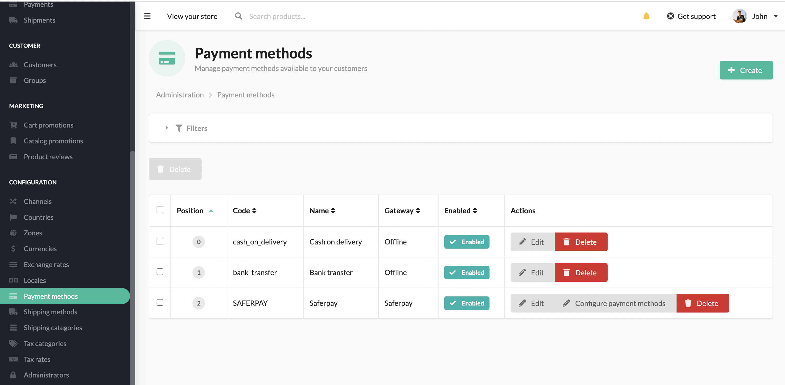

# Sylius Saferpay Plugin

 

## Content

1. [Requirements](#requirements)
1. [Overview](#overview)
1. [Features](#features)
1. [About Saferpay](#about-saferpay)
1. [Installation](docs/installation.md)
1. [Configuration](docs/configuration.md)
1. [Development](docs/development.md)
1. [Testing](docs/testing.md)
1. [Cooperation](#cooperation)
1. [License](#license)
1. [About us](#about-us)

### Requirements

| Package       | Version |
|---------------|---------|
| PHP           | ^8.0    |
| sylius/sylius | ^1.10.0 |

### Overview

This plugin adds integration with [Worldline Saferpay](https://www.saferpay.com) to [Sylius](https://github.com/Sylius/Sylius).

### Features

- Saferpay payment method configuration (both test and live environments)
- Payment method transaction logs
- "Debug" mode that allows to log all the logs not only error/failed ones
- Configuration panel to filter which payments should be used with Saferpay
- Webhooks integration for authorization, capture and cancellation
- Refunds with default Sylius refunding process (RefundPlugin integration in the future)

Checkout:

Configured Saferpay payment method:

Payments logs:

Saferpay panel:

### About Saferpay

Saferpay is a modern, all-in-one payment solution, particularly popular in the DACH region due to origins of its
previous owner - SIX Payments - which is a Swiss company acquired by Worldline - a French fintech group. 
Saferpay now offers integrations with all major payment methods, incl. local ones like TWINT, major card operators
(VISA, Mastercard), and globally used wallets like ApplePay, GooglePay, PayPal, etc.

- Free of charge activation of all major means of payment
- Individual payment pages
- Mail-/Phone-Order payments
- Creation and sending of individual payment links
- Acceptance of mobile payments using QR codes
- Payment API & Management API for automation of payments
- Saferpay Backoffice for a complete overview
- Saferpay Risk Management & User Administration
- Saferpay Plugins available for your shop system
- Highest security standards thanks to PCI DSS, PSD2 and 3-D Secure 2
- Dynamic currency conversion DCC: your international customers pay in their local currency

### Cooperation

This plugin was sponsored by [WTG Innovation](https://www.wtg.com/innovation) and developed in cooperation
with their Team. Thank you for your contribution to the open-source ecosystem!

### License

This plugin's source code is completely free and released under the terms of the MIT license.

### Security

If you find anything that could be a security problem, please reach us first on security@commerceweavers.com
in order to prepare a patch before disclosure.

### Support

As plugin creators, we will be happy to help you implement it in your system and maintain it later on.
If you wish to use the free-of-charge community support, make sure to join the [Sylius Slack](https://sylius-community.slack.com/).
We encourage you to use the official Sylius resources to feel more confident in using this plugin:

- [Sylius Documentation](https://docs.sylius.com/en/latest/)
- [Sylius Online Course](https://sylius.com/online-course/)
- [Sylius Stack Overflow](https://stackoverflow.com/questions/tagged/sylius)

### About us

- [Commerce Weavers](https://www.commerceweavers.com/) are the web agency formed by ex-Sylius company members, and long-term core team & community leaders of Sylius - the open-source e-commerce framework based on Symfony, PHP.
- With these origins, we naturally provide services related to all above mentioned technologies - using Sylius, Symfony, and API Platform for various applications development and maintenance.
- We also actively contribute to the open-source community by creating dedicated plugins and visiting tech events.
- We are probably the most active company promoting Sylius on industry meetups - our speakers can be frequently seen at the stages of the biggest PHP & Symfony conferences throught Europe, and beyond.
- In need of training or consulting? We love knowledge sharing and have a proven track record of over 200 trained developers all over Europe. [Get in touch!](https://www.commerceweavers.com/#contact)

