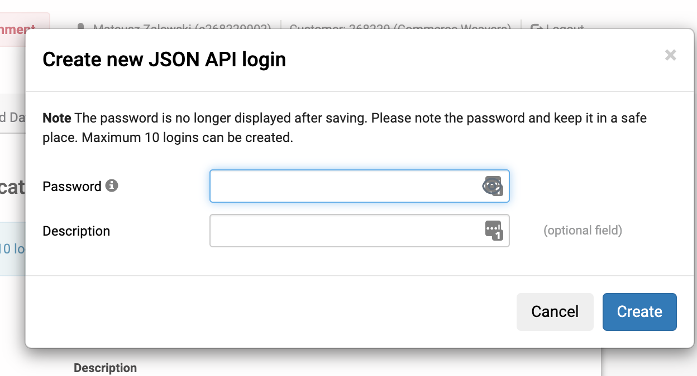

## Configuration

To configure the Saferpay payment method, you need to register on the Saferpay Worldline website.
Let's start with the test environment - it can be done [here](https://test.saferpay.com/BO/SignUp).

After you successfully create an account and log in, you can move forward to its configuration:

1. Create the API credentials

2. Specify its password (and remember it! it will be used later)

3. Save Customer ID and API username (you will need them later as well)

4. Take a look at the Terminal and its ID (also needed for the further configuration)

5. Now you can configure Saferpay payment method in Sylius

6. Fill in the form with the data you've got from the Saferpay panel

7. Beware! By default, after payment method's creation there are no payment methods enabled for Saferpay. To configure them
go to the `/admin/payment-methods/{id}/configure-saferpay-payment-methods` URL and check out which payment methods you would
like to use.

Done! You're now ready to use Saferpay payment method in your webshop 🎉

---

Prev: [Installation](installation.md)
Next: [Development](development.md)
