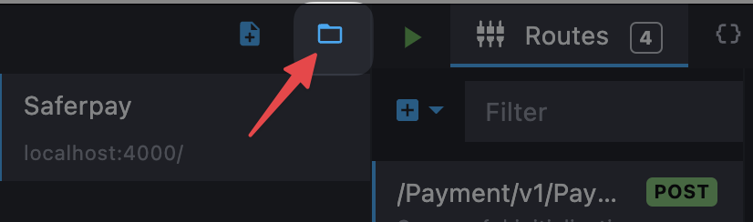
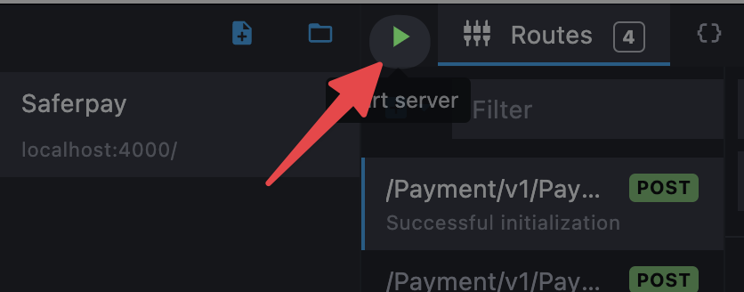

## Mockoon

### About Mockoon

Mockoon is a free and open source desktop application allowing to quickly mock HTTP responses. It is available for Windows, macOS and Linux.

Mockoon is used in this project to mock the API responses during the tests. This allows to test the application without having to rely on a real API.

### Install Mockoon

To install Mockoon, please follow the [official installation instructions](https://mockoon.com/#download).

### Import Mockoon configuration

To import the Mockoon configuration:

1. Open Mockoon
2. Click on the **Open environment** button  

3. Select the `mockoon.json` file located in the `tests` directory of the project
4. Click on the **Start server** button  

Now your Mockoon server is running and ready to receive requests on the `:4000` port.
